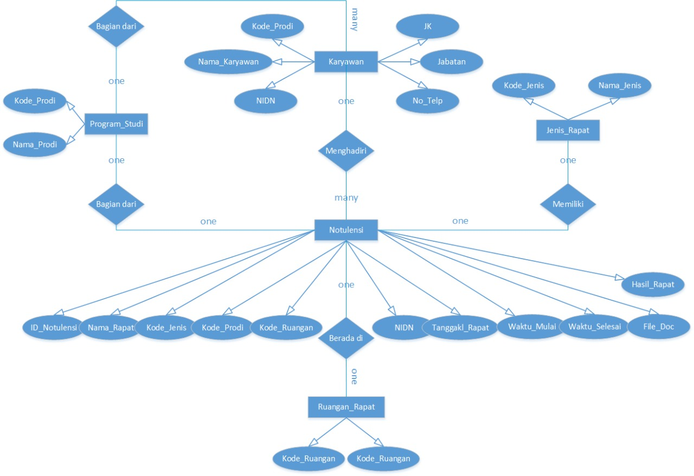

# Tentang Software

## Tujuan Software

Software ini digunakan untuk mengelola notulensi rapat pada suatu perguruan tinggi. Ada 2 peran disitu:

1. Admnistrator: mempunyai wewenang penah untuk mengelola semua data
2. Staf: mempunyai wewenang penuh pada beberapa fasilitas saja.

**Administrator** mempunyai hak akses untuk semua data back-end maupun mengelola rapat:

* Mengisi berbagai rincian back-end: user, prodi, ruangan, notulensi, presensi
* Mengisi hasil rapat: teks, foto, dokumen
* Mencetak hasil rapat

**Staf** mempunyai hak akses untuk:

* Menampilkan rincian rapat
* Mencari rapat: berdasarkan nama pemimpin rapat, tanggal rapat, dan jenis rapat
* Mencetak hasil rapat 

## Peranti Pengembangan yang Digunakan

* Laravel 5.7
* PHP 7.3.2
* MariaDB 10.1.38

## Rancangan Basis Data

Diagram E-R

Tabel dan Tipe Data

1. Rapat
   - kode_rapat (varchar 10 - primary key)
   - nama_rapat (varchar 50)
2. Prodi

