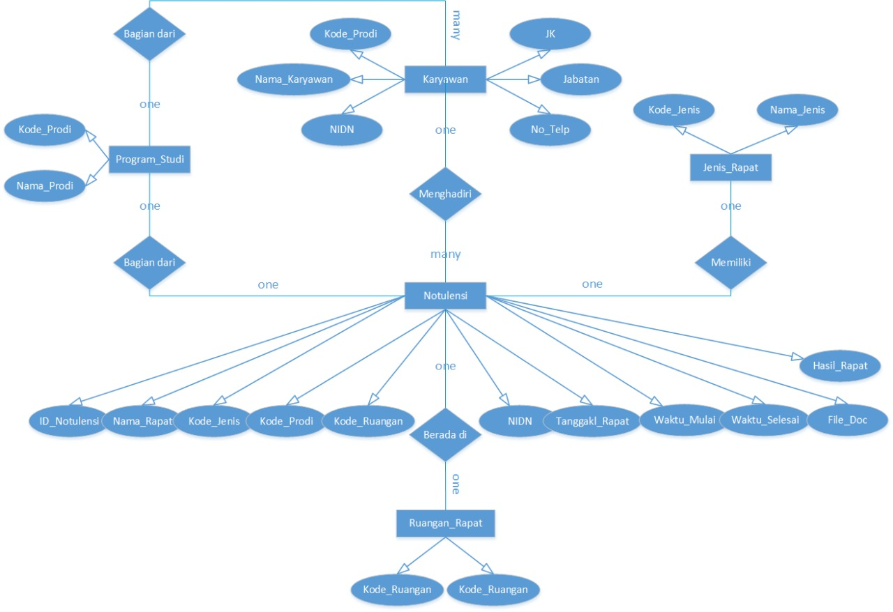
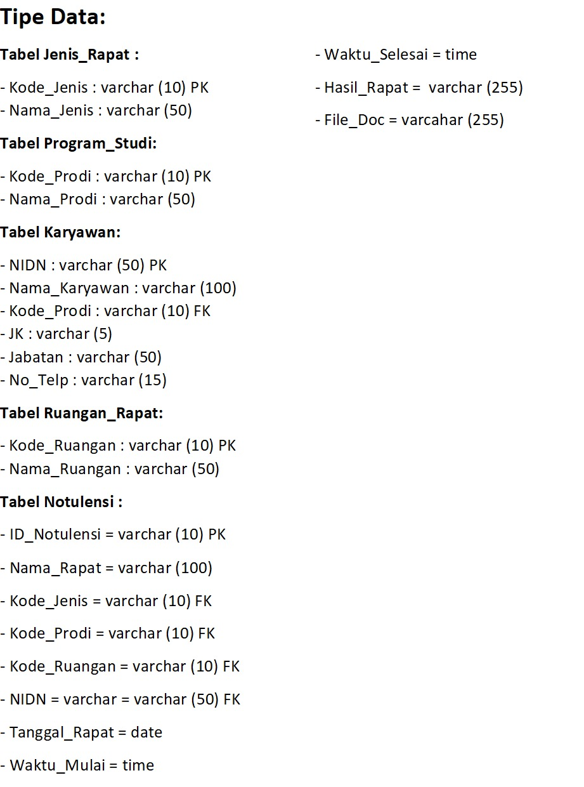

# Laravel-based Meetings Management Software

## Tentang Software

### Tujuan Software

Software ini digunakan untuk mengelola notulensi rapat pada suatu perguruan tinggi. Ada 2 peran disitu:

1. Admnistrator: mempunyai wewenang penah untuk mengelola semua data
2. Staf: mempunyai wewenang penuh pada beberapa fasilitas saja.

**Administrator** mempunyai hak akses untuk semua data back-end maupun mengelola rapat:

* Mengisi berbagai rincian back-end: user, prodi, ruangan, notulensi, presensi
* Mengisi hasil rapat: teks, foto, dokumen
* Mencetak hasil rapat

**Staf** mempunyai hak akses untuk:

* Menampilkan rincian rapat
* Mencari rapat
* Mencetak hasil rapat 

### Peranti Pengembangan yang Digunakan

* Laravel 5.7
* PHP 7.3.2
* MariaDB 10.1.38

### Rancangan Basis Data

Diagram E-R



Tipe Data



Buat *database* di MariaDB dan sesuaikan hak aksesnya di **.env**. Database yang dibuat harus menggunakan *utf8mb4_unicode_ci* charset.

## Instalasi Laravel dan Memulai Pembuatan Software

Untuk instalasi Laravel, diperlukan [Composer](https://getcomposer.org). Install Composer terlebih dahulu, setelah itu:

```bash
$ composer global require laravel/installer
```

Jika menggunakan Linux, hasilnya akan berada di $HOME/.config/composer/vendor. Masukkan direktori bin disitu ke $PATH. Setelah itu kita bisa menggunakan Laravel. Buat aplikasi baru Laravel di direktori bebas:

```bash
$ laravel new notulensi
```

Perintah di atas akan membuat aplikasi Laravel di direktori **$current_directory/notulensi**. 

## Membuat Rerangka Otentikasi User

Laravel secara default menyediakan fasilitas untuk CRUD users. Meskipun demikian, tidak ada role untuk fasilitas native Laravel tersebut. Bagian ini akan membahas cara menggunakan role pada Laravel dengan mengubah fasilitas native tersebut.

Untuk awal, Laravel sudah menyediakan migrasi untuk membuat users pada migrations:

```bash
$ ls -la database/migrations/
total 16
drwxr-xr-x 2 bpdp bpdp 4096 Feb 25 11:14 ./
drwxr-xr-x 5 bpdp bpdp 4096 Feb 25 11:14 ../
-rw-r--r-- 1 bpdp bpdp  810 Feb 25 11:14 2014_10_12_000000_create_users_table.php
-rw-r--r-- 1 bpdp bpdp  683 Feb 25 11:14 2014_10_12_100000_create_password_resets_table.php
$
```

File **2014_10_12_000000_create_users_table.php** akan kita edit supaya bisa menampung data pegawai serta role. Pada method **up**, edit:

```php
public function up()
    {
        Schema::create('users', function (Blueprint $table) {
            $table->increments('id');
            $table->string('nidn', 50)->unique();
            $table->string('kode_prodi', 10);
            $table->string('name');
            $table->string('jk', 6);
            $table->string('jabatan', 50);
            $table->string('no_telp', 15);
            $table->string('email')->unique();
            $table->timestamp('email_verified_at')->nullable();
            $table->string('password');
            $table->string('role');
            $table->rememberToken();
            $table->timestamps();
        });
    }
```

Sebelum proses migrasi, harus diperiksa terlebih dahulu apakah penggunaan MariaDB mengakibatkan ada beberapa perubahan atau tidak. Laravel mengubah charset menjadi utf8mb4 mulai Laravel 5.4. Perubahan ini mengakibatkan beberapa penyesuaian. MariaDB yang digunakan adalah MariaDB versi 10.1.38. Versi ini memerlukan penyesuaian (semua versi dibawah 10.2.2 harus disesuaikan). Jika tidak dilakukan penyesuaian, mungkin pada saat melakukan migrasi akan muncul error:

```bash
PDOException::("SQLSTATE[42000]: Syntax error or access violation: 1071 Specified key was too long; max key length is 767 bytes")
```

Error di atas terjadi misalnya pada saat menggunakan make:auth saat melakukan migrasi (php artisan migrate). Untuk memperbaiki ini ada file yang harus diedit. Saat melakukan migrasi, Laravel harus diberitahu default panjang string yang dihasilkan oleh migrasi. Edit file **app/Providers/AppServiceProvider.php** dengan menetapkan default panjang string:

```php
<?php

namespace App\Providers;

use Illuminate\Support\ServiceProvider;
// penambahan baris 1:
use Illuminate\Support\Facades\Schema;

class AppServiceProvider extends ServiceProvider
{
    /**
     * Register any application services.
     *
     * @return void
     */
    public function register()
    {
        //
    }
/**
     * Bootstrap any application services.
     *
     * @return void
     */
    public function boot()
    {
	// penambahan baris 2:
        Schema::defaultStringLength(191);
    }
}
```

Setelah itu migrate dengan menggunakan perintah berikut di *root directory* dari software:

```bash
$ php artisan migrate
Migration table created successfully.
Migrating: 2014_10_12_000000_create_users_table
Migrated:  2014_10_12_000000_create_users_table
Migrating: 2014_10_12_100000_create_password_resets_table
Migrated:  2014_10_12_100000_create_password_resets_table
$
```

Setelah menyiapkan model untuk user dan role, generate scaffolding untuk otentikasi:

```bash
$ php artisan make:auth
Authentication scaffolding generated successfully.
$
```

Setelah itu, edit file **resources/views/auth/register.blade.php** untuk menyertakan field-field baru tersebut:

```html
@extends('layouts.app')
@section('content')
<div class="container">
    <div class="row justify-content-center">
        <div class="col-md-8">
            <div class="card">
                <div class="card-header">{{ __('Register') }}</div>
<div class="card-body">
                    <form method="POST" action="{{ route('register') }}">
                        @csrf
<div class="form-group row">
    <label for="nidn" class="col-md-4 col-form-label text-md-right">NIDN</label>
<div class="col-md-6">
<input id="nidn" type="text" class="form-control{{ $errors->has('nidn') ? ' is-invalid' : '' }}" name="nidn" value="{{ old('nidn') }}" required autofocus>
@if ($errors->has('nidn'))
            <span class="invalid-feedback" role="alert">
                <strong>{{ $errors->first('nidn') }}</strong>
            </span>
        @endif
</div>
</div>
<div class="form-group row">
    <label for="kode_prodi" class="col-md-4 col-form-label text-md-right">Program Studi</label>
<div class="col-md-6">
        <select name="kode_prodi" class="form-control" >
            <option value="prodi1">Program Studi 1</option>
            <option value="prodi2">Program Studi 2</option>
        </select>
    </div>
</div>
<div class="form-group row">
                            <label for="name" class="col-md-4 col-form-label text-md-right">{{ __('Name') }}</label>
<div class="col-md-6">
                                <input id="name" type="text" class="form-control{{ $errors->has('name') ? ' is-invalid' : '' }}" name="name" value="{{ old('name') }}" required autofocus>
@if ($errors->has('name'))
                                    <span class="invalid-feedback" role="alert">
                                        <strong>{{ $errors->first('name') }}</strong>
                                    </span>
                                @endif
                            </div>
                        </div>
<div class="form-group row">
    <label for="jk" class="col-md-4 col-form-label text-md-right">Jenis Kelamin</label>
<div class="col-md-6">
        <select name="jk" class="form-control" >
            <option value="wanita">Wanita</option>
            <option value="pria">Pria</option>
        </select>
    </div>
</div>
<div class="form-group row">
    <label for="jabatan" class="col-md-4 col-form-label text-md-right">Jabatan</label>
<div class="col-md-6">
<input id="jabatan" type="text" class="form-control{{ $errors->has('jabatan') ? ' is-invalid' : '' }}" name="jabatan" value="{{ old('jabatan') }}" required autofocus>
@if ($errors->has('jabatan'))
            <span class="invalid-feedback" role="alert">
                <strong>{{ $errors->first('jabatan') }}</strong>
            </span>
        @endif
</div>
</div>
<div class="form-group row">
    <label for="no_telp" class="col-md-4 col-form-label text-md-right">Nomor Telepon</label>
<div class="col-md-6">
<input id="no_telepon" type="text" class="form-control{{ $errors->has('no_telp') ? ' is-invalid' : '' }}" name="no_telp" value="{{ old('no_telp') }}" required autofocus>
@if ($errors->has('no_telp'))
            <span class="invalid-feedback" role="alert">
                <strong>{{ $errors->first('no_telp') }}</strong>
            </span>
        @endif
</div>
</div>
<div class="form-group row">
                            <label for="email" class="col-md-4 col-form-label text-md-right">{{ __('E-Mail Address') }}</label>
<div class="col-md-6">
                                <input id="email" type="email" class="form-control{{ $errors->has('email') ? ' is-invalid' : '' }}" name="email" value="{{ old('email') }}" required>
@if ($errors->has('email'))
                                    <span class="invalid-feedback" role="alert">
                                        <strong>{{ $errors->first('email') }}</strong>
                                    </span>
                                @endif
                            </div>
                        </div>
<div class="form-group row">
                            <label for="password" class="col-md-4 col-form-label text-md-right">{{ __('Password') }}</label>
<div class="col-md-6">
                                <input id="password" type="password" class="form-control{{ $errors->has('password') ? ' is-invalid' : '' }}" name="password" required>
@if ($errors->has('password'))
                                    <span class="invalid-feedback" role="alert">
                                        <strong>{{ $errors->first('password') }}</strong>
                                    </span>
                                @endif
                            </div>
                        </div>
<div class="form-group row">
                            <label for="password-confirm" class="col-md-4 col-form-label text-md-right">{{ __('Confirm Password') }}</label>
<div class="col-md-6">
                                <input id="password-confirm" type="password" class="form-control" name="password_confirmation" required>
                            </div>
                        </div>
<div class="form-group row">
    <label for="role" class="col-md-4 col-form-label text-md-right">Role</label>
<div class="col-md-6">
        <select name="role" class="form-control" >
            <option value="admin">Admin</option>
            <option value="staf">Staf</option>
        </select>
    </div>
</div>
<div class="form-group row mb-0">
                            <div class="col-md-6 offset-md-4">
                                <button type="submit" class="btn btn-primary">
                                    {{ __('Register') }}
                                </button>
                            </div>
                        </div>
                    </form>
                </div>
            </div>
        </div>
    </div>
</div>
@endsection
```

Untuk membuat supaya isian-isian tersebut merupakan hasil input, Ubah *fillable* pada **app/User.php**:

```php
protected $fillable = [
        'nidn', 'kode_prodi', 'name', 'jk', 'jabatan', 'no_telp', 'email', 'password', 'role',
    ];
```

Edit controller **app/Http/Controllers/Auth/RegisterController.php**. Perhatikan pada *validator* dan *create*, bagian tersebut diubah untuk semua field-field baru.

```php
<?php
namespace App\Http\Controllers\Auth;
use App\User;
use App\Http\Controllers\Controller;
use Illuminate\Support\Facades\Hash;
use Illuminate\Support\Facades\Validator;
use Illuminate\Foundation\Auth\RegistersUsers;
class RegisterController extends Controller
{
    /*
    |--------------------------------------------------------------------------
    | Register Controller
    |--------------------------------------------------------------------------
    |
    | This controller handles the registration of new users as well as their
    | validation and creation. By default this controller uses a trait to
    | provide this functionality without requiring any additional code.
    |
    */
use RegistersUsers;
/**
     * Where to redirect users after registration.
     *
     * @var string
     */
    protected $redirectTo = '/home';
/**
     * Create a new controller instance.
     *
     * @return void
     */
    public function __construct()
    {
        $this->middleware('guest');
    }
/**
     * Get a validator for an incoming registration request.
     *
     * @param  array  $data
     * @return \Illuminate\Contracts\Validation\Validator
     */
    protected function validator(array $data)
    {
        return Validator::make($data, [
            'nidn' => ['required', 'string', 'max:50'],
            'kode_prodi' => ['required', 'in:prodi1,prodi2'],
            'name' => ['required', 'string', 'max:255'],
            'jk' => ['required', 'in:wanita,pria'],
            'jabatan' => ['required', 'string', 'max:50'],
            'no_telp' => ['required', 'string', 'max:15'],
            'email' => ['required', 'string', 'email', 'max:255', 'unique:users'],
            'password' => ['required', 'string', 'min:6', 'confirmed'],
            'role' => ['required', 'in:admin,staf'],
        ]);
    }
/**
     * Create a new user instance after a valid registration.
     *
     * @param  array  $data
     * @return \App\User
     */
    protected function create(array $data)
    {
        return User::create([
            'nidn' => $data['nidn'],
            'kode_prodi' => $data['kode_prodi'],
            'name' => $data['name'],
            'jk' => $data['jk'],
            'jabatan' => $data['jabatan'],
            'no_telp' => $data['no_telp'],
            'email' => $data['email'],
            'password' => Hash::make($data['password']),
            'role' => $data['role'],
        ]);
    }
}
```

Untuk mencoba hasilnya:

```bash
$ php artisan serve
```

Setelah itu akses ke http://localhost:8000/, Coba register dan setelah itu logout kemudian login.


 
